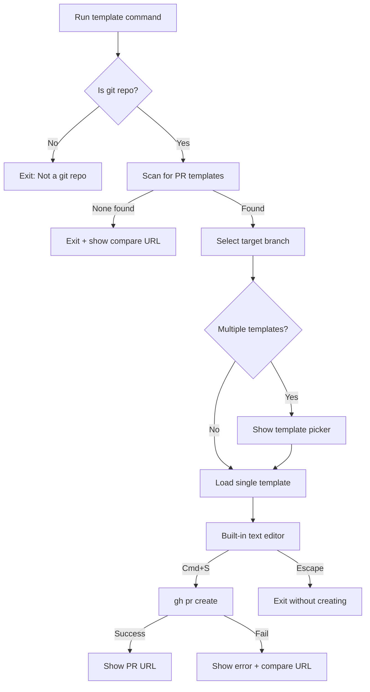
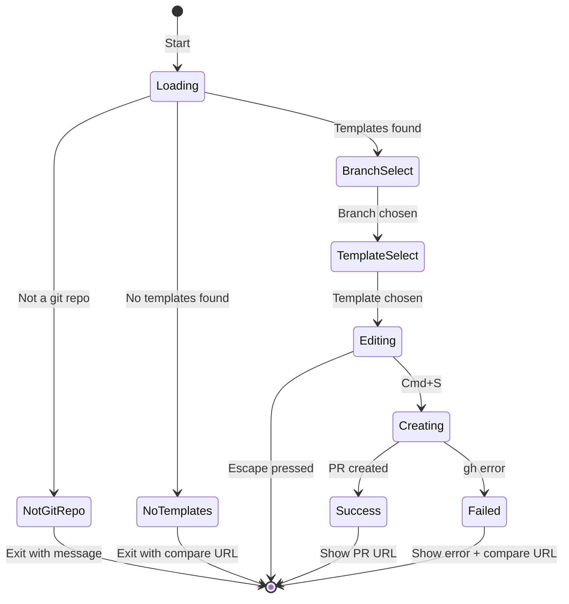

# Template PR TUI

## Overview

A terminal UI application built with `@opentui/react` that streamlines creating GitHub PRs from templates. Installed globally via `bun build --compile` and invoked with the `template` command.

## User Flow



## File Structure

```
src/
  index.tsx              # Entry point, app state machine
  components/
    Header.tsx           # GitHub-style merge direction header
    BranchPicker.tsx     # Branch selection UI
    TemplatePicker.tsx   # Template selection UI  
    Editor.tsx           # Built-in text editor component
    StatusBar.tsx        # Bottom status bar (hints, PR creation status)
  lib/
    git.ts               # Git operations (get branches, current branch)
    templates.ts         # Template discovery and loading
    pr.ts                # GitHub CLI integration
```

## UI Design

**Header Component ([`src/components/Header.tsx`](src/components/Header.tsx))**

Mimics GitHub's PR merge direction display:

```
┌─────────────────────────────────────────────────────────────────┐
│  Create Pull Request                                            │
│                                                                 │
│  Merging into  develop  ←  feature/val-493-quickbooks-data      │
│                 ▲                                               │
│            [selecting]                                          │
└─────────────────────────────────────────────────────────────────┘
```

Terminal styling:

- Target branch: highlighted/colored (e.g., cyan background)
- Current branch: dimmed or different color
- Arrow `←` to show merge direction
- Current branch always visible throughout the flow

## Key Implementation Details

### 1. Template Discovery ([`src/lib/templates.ts`](src/lib/templates.ts))

Scan for templates in order:

- `.github/PULL_REQUEST_TEMPLATE/` folder (multiple `.md` files)
- `.github/PULL_REQUEST_TEMPLATE.md` (single file)
- `PULL_REQUEST_TEMPLATE.md` (root level fallback)

### 2. Git Utilities ([`src/lib/git.ts`](src/lib/git.ts))

**Get current branch (displayed in header):**

```typescript
const getCurrentBranch = async () => {
  return (await $`git branch --show-current`.text()).trim()
}
```

**Get repo compare URL for fallback:**

```typescript
const getCompareUrl = async () => {
  const remote = await $`git remote get-url origin`.text()
  // Parse SSH or HTTPS format -> https://github.com/{owner}/{repo}/compare
}
```

Handles both formats:

- `git@github.com:owner/repo.git` -> `https://github.com/owner/repo/compare`
- `https://github.com/owner/repo.git` -> `https://github.com/owner/repo/compare`

**Branch Selection:**

```typescript
// Priority order for base branch options
const getBranchOptions = async () => {
  const remoteBranches = await $`git branch -r`.text()
  // Parse and prioritize: develop first, then main OR master, then others
}
```

- Run `git branch -r` to get remote branches
- Filter to `origin/*` branches, strip prefix
- Sort: `develop` first, then `main` or `master` (only show one if both exist), then alphabetical others

### 3. Built-in Editor ([`src/components/Editor.tsx`](src/components/Editor.tsx))

- Multi-line text input with cursor navigation
- Pre-populated with template content
- Handle `Cmd+S` (meta+s) to trigger save/submit
- Handle `Escape` to cancel
- Show line numbers and cursor position

### 4. PR Creation ([`src/lib/pr.ts`](src/lib/pr.ts))

```typescript
// Write body to temp file, invoke gh cli
const createPR = async (baseBranch: string, title: string, body: string) => {
  const tempFile = `${os.tmpdir()}/pr-body-${Date.now()}.md`
  await Bun.write(tempFile, body)
  const result = await $`gh pr create --base ${baseBranch} --title ${title} --body-file ${tempFile}`
  return result
}
```

### 5. Distribution (GitHub Package Install)

Update `package.json` for CLI distribution:

```json
{
  "name": "templatr",
  "bin": {
    "template": "./src/index.tsx"
  },
  "files": ["src"],
  "scripts": {
    "dev": "bun run --watch src/index.tsx"
  }
}
```

**Installation (documented in README):**

```bash
# Global install
bun add -g github:yourusername/templatr

# Verify
template
```

**Requirements:** Bun must be installed (runs TypeScript directly).

**README.md structure:**

- Brief description
- Installation command
- Usage
- Requirements (Bun, gh CLI)

## App State Machine



## Error Handling

Graceful failures with actionable output:

| Error | Behavior |

|-------|----------|

| No templates found | Exit with message + clickable compare URL |

| Not a git repo | Exit with clear message |

| No remote origin | Exit with message explaining remote required |

| `gh` CLI not installed | Exit with install instructions |

| PR creation fails | Show error + compare URL fallback |

**No Templates Example Output:**

```
No PR templates found in this repository.

Create a PR manually:
  https://github.com/vallypro/vally/compare
```

**Implementation in [`src/lib/git.ts`](src/lib/git.ts):**

```typescript
const getCompareUrl = async (): Promise<string | null> => {
  const remote = await $`git remote get-url origin`.text().catch(() => null)
  if (!remote) return null
  
  // git@github.com:owner/repo.git -> https://github.com/owner/repo
  // https://github.com/owner/repo.git -> https://github.com/owner/repo
  const match = remote.match(/github\.com[:/](.+?)(?:\.git)?$/)
  if (!match) return null
  
  return `https://github.com/${match[1].trim()}/compare`
}
```

## Key Hooks from @opentui/react

- `useKeyboard()` - Handle Cmd+S, Escape, arrow keys
- `useRenderer()` - Access renderer for cleanup on exit
- `<select>` component - Branch and template pickers
- `<box>` and `<text>` - Layout and text display